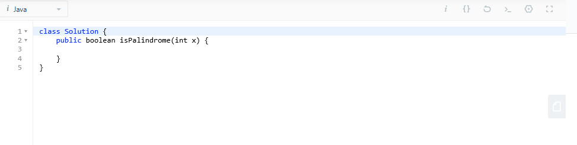
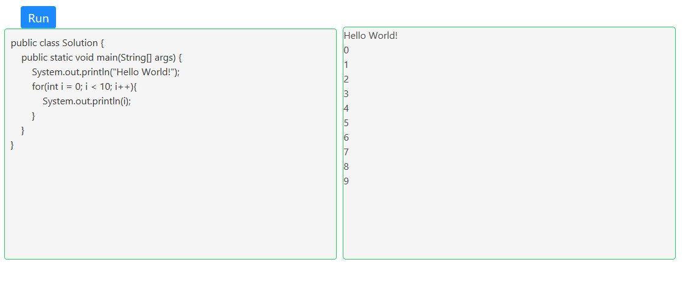

# Do-Java-Online
Java Online Executor
### 背景
最近一直在做LeetCode上的算法题，像这种在线编程网站都会提供一个在线编写，运行代码的窗口，如下图。

正好最近在看周志明老师的《深入理解Java虚拟机》这本书，在书中的第九章《类加载及执行子系统的案例与实战》中详细讲解了“如何实现远程执行功能”，与上述在线执行器的思路一致。
结合TangBean同学的[OnlineExecutor](https://github.com/TangBean/OnlineExecutor)项目，后续会完善多个相关功能：
- [X] 用户注册登录
- [ ] 界面太丑，有待美化
- [ ] 上传文件，显示
### 展示

### 原理
在程序实现的过程中，我们需要解决三个问题：
- 如何编译页面编写的Java代码
- 如何执行编译之后的Java代码
- 如何收集Java代码的执行结果

#### 问题一解决方案：
使用javax.tools包可以实现Java源代码编译，优点如下：
- 它是经过认可的 Java SE 扩展，这意味着它是 Java Community Process（按照 JSR 199 规范）开发的标准 API。com.sun.tools.javac.Main API 不属于 经过文件归档的 Java 平台 API，因此没有必要在其他供应商的 JDK 中提供或保证在未来版本的 Sun JDK 中提供该 API。
- 您可以应用已经掌握的知识：Java 源代码，而不是字节码。不需要学习生成有效字节码的复杂规则或者新的类对象模型、方法、语句和表达式，通过生成有效的 Java 源代码，您就可以创建正确的 Java 类。
- 它简化了一种受支持机制，并进行了标准化，使您不用局限于基于文件的源代码就可生成并加载代码。 
- 它可以在 JDK Version 6 和更高版本的各种供应商实现之间移植，并且将来也支持这种移植性。
- 它使用经过验证的 Java 编译器。
- 与基于解释器的系统不同，所加载的类可以从 JRE 的运行时优化中受益。

#### 问题二解决方案:
要执行编译后的Java代码，让类加载器加载这个类生成一个Class对象，然后反射调用一下某个方法就可以了（因为不实现任何接口，我们可以借用一下Java中人人皆知的“main()”方法）。但我们还应该考虑到：一段程序往往不是编写、运行一次就能达到效果，同一个类可能要反复修改、提交、执行。还有，既然提交的是临时代码，那提交Java类在执行完后就应当能卸载和回收。

#### 问题三解决方案：
把程序往标准输出（System.out）和标准错误输出（System.err）中打印的信息收集起来，但标准输出设备是整个虚拟机进程全局共享的资源，如果使用System.setOut()/System.setErr()方法把输出流重定向到自己定义的PrintStream对象上固然可以收集输出信息，但也会对原有程序产生影响；会把其他线程向标准输出中打印的信息也收集了。虽然这些并不是不能解决的问题，不过为了达到完全不影响原程序的目的，我们可以采用另外一种办法，即直接在执行的类中把对System.out的符号引用替换为我们准备的PrintStream的符号引用。

### 祝进步 
